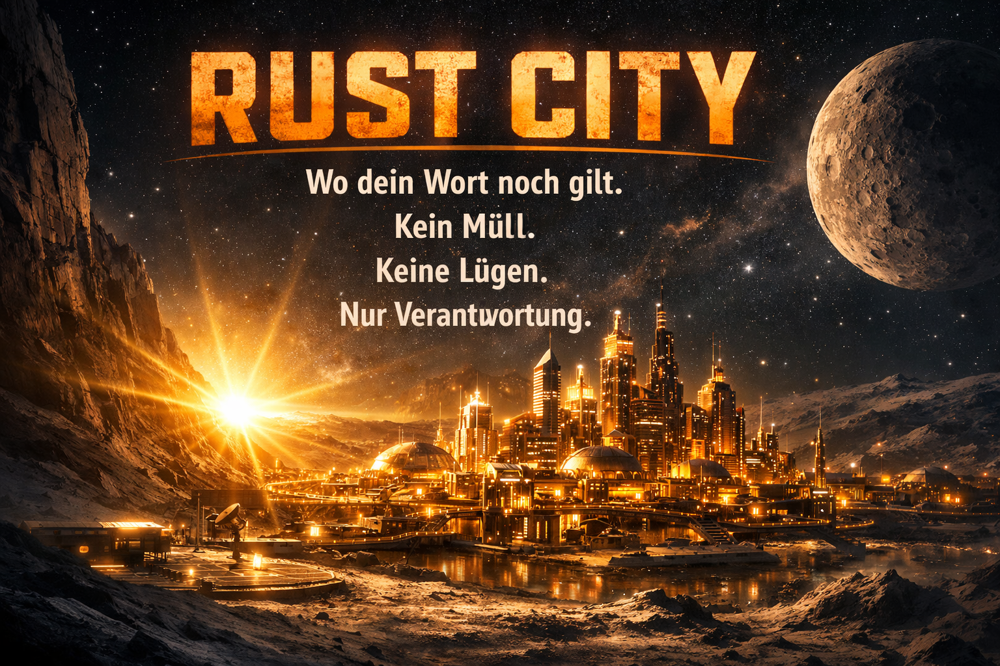

# 🏙️ Rust City




---

## DE 🇩🇪

**Rust City** ist kein normales Programmierbuch.

Es ist die Geschichte von Okto — einem kleinen Trashbot der nicht weiss wer er ist.  
Kapitel für Kapitel entdeckt er es. Und du lernst dabei Rust.

Nicht weil du musst. Nur wenn du willst.

### Was dich erwartet

Drei Bücher. Elf Kapitel. Eine Frage:

> **Findet Okto seinen Platz — und versteht er, was am Eingangstor steht?**

Am Eingangstor von Rust City stehen drei Sätze.  

```
Was du besitzt, das pflege.
Was du leihst, das schütze.
Was du nicht mehr brauchst, gib es der Welt zurück.
```

Okto liest sie. Aber er versteht sie noch nicht.  
Noch nicht.

### 📗 Buch 1 — Wer bin ich? *(Kapitel 1–5)*

| Kapitel | Titel | Rust-Konzept |
|---------|-------|--------------|
| [Kapitel 1](blog/content/chapters/chapter-01.md) | Willkommen in Rust City | Crates, Modules, Cargo |
| [Kapitel 2](blog/content/chapters/chapter-02.md) | Detective Ownership & Officer Borrowing | Ownership, Borrowing, Borrow Checker |
| [Kapitel 3](blog/content/chapters/chapter-03.md) | Agentin Alias | References, Aliasing, Type Aliases |
| [Kapitel 4](blog/content/chapters/chapter-04.md) | Max Mutation | Mutability, mut |
| [Kapitel 5](blog/content/chapters/chapter-05.md) | Madame Enum und ihre Typen | Enums, Structs, Pattern Matching |

### 📘 Buch 2 — Was kann ich? *(Kapitel 6–9)*

| Kapitel | Titel | Rust-Konzept |
|---------|-------|--------------|
| [Kapitel 6](blog/content/chapters/chapter-06.md) | Das Match-Labyrinth | Match, Patterns |
| [Kapitel 7](blog/content/chapters/chapter-07.md) | Okto baut | Crates, Modules, pub vs private |
| [Kapitel 8](blog/content/chapters/chapter-08.md) | Was du besitzt | Collections: Vec, HashMap, Iterators |
| [Kapitel 9](blog/content/chapters/chapter-09.md) | Richtig scheitern | Result, Option, Error Handling |

### 📙 Buch 3 — Was bin ich wirklich? *(Kapitel 10–11)*

| Kapitel | Titel | Rust-Konzept |
|---------|-------|--------------|
| [Kapitel 10](blog/content/chapters/chapter-10.md) | Was bin ich wirklich | Traits, trait bounds, impl |
| [Kapitel 11](blog/content/chapters/chapter-11.md) | Alles was lebt hat eine Lifetime | Lifetimes, lifetime annotations |

---

### 👥 Die Bewohner von Rust City

| Charakter | Rolle |
|-----------|-------|
| [🤖 Okto](blog/content/characters/okto.md) | Der Protagonist — still, neugierig, ausdauernd |
| [🕵️ Detective Ownership](blog/content/characters/ownership.md) | Der stille Vater — ruhig, präzise, väterlich |
| [👮 Officer Borrowing](blog/content/characters/borrowing.md) | Der gerechte Ordnungshüter — knallhart, theatralisch, fair |
| [🕵️‍♀️ Agentin Alias](blog/content/characters/alias.md) | Die Faszinierende — elegant, ungreifbar, präzise |
| [🎭 Max Mutation](blog/content/characters/max.md) | Der Kontrast — impulsiv, neugierig, ehrlich |
| [🎭 Madame Enum](blog/content/characters/enum.md) | Die Weise — weise, geduldig, klar |
| [🎩 fn main()](blog/content/characters/fn-main.md) | Der verlässliche Ursprung — präsent, still, immer da |

---

### Für wen ist das?

„Dieses Buch ist Open Source. Du darfst es lesen, teilen und verbessern – genau wie die Software, die wir hier lernen.“

**Hinweis für Reisende :** 

> Wenn du vom Rust Cookbook kommst, sieh dieses Buch als deine Raststätte in den Nebelgassen von Rust City. Während das Cookbook dir zeigt, wie man die Maschinen repariert, zeigen wir dir hier, warum die Stadt so gebaut wurde, wie sie ist. "Rust City" ersetzt kein technisches Handbuch – es macht die Logik dahinter fühlbar. Es ist der Ort, an dem trockene Theorie zu einer lebendigen Geschichte wird.

Rust City verspricht kein Glück.  
Es verspricht: **kein Pech** — wenn du die Regeln kennst.

---

## EN 🇬🇧

**Rust City** is not a normal programming book.

It's the story of Okto — a small trashbot who doesn't know who he is.  
Chapter by chapter, he finds out. And along the way, you learn Rust.

Not because you have to. Only if you want to.

### What to expect

Three books. Eleven chapters. One question:

> **Will Okto find his place — and will he understand what's written above the city gate?**

Above the gate of Rust City, three sentences are carved in stone.  

```
What you own, tend to it.
What you borrow, protect it.
What you no longer need, give it back to the world.
```

Okto reads them. But he doesn't understand them yet.  
Not yet.

### 📗 Book 1 — Who am I? *(Chapters 1–5)*

| Chapter | Title | Rust concept |
|---------|-------|--------------|
| [Chapter 1](blog/content/chapters/chapter-01.md) | Welcome to Rust City | Crates, Modules, Cargo |
| [Chapter 2](blog/content/chapters/chapter-02.md) | Detective Ownership & Officer Borrowing | Ownership, Borrowing, Borrow Checker |
| [Chapter 3](blog/content/chapters/chapter-03.md) | Agent Alias | References, Aliasing, Type Aliases |
| [Chapter 4](blog/content/chapters/chapter-04.md) | Max Mutation | Mutability, mut |
| [Chapter 5](blog/content/chapters/chapter-05.md) | Madame Enum and her Types | Enums, Structs, Pattern Matching |

### 📘 Book 2 — What can I do? *(Chapters 6–9)*

| Chapter | Title | Rust concept |
|---------|-------|--------------|
| [Chapter 6](blog/content/chapters/chapter-06.md) | The Match Labyrinth | Match, Patterns |
| [Chapter 7](blog/content/chapters/chapter-07.md) | Okto Builds | Crates, Modules, pub vs private |
| [Chapter 8](blog/content/chapters/chapter-08.md) | What you own | Collections: Vec, HashMap, Iterators |
| [Chapter 9](blog/content/chapters/chapter-09.md) | Failing right | Result, Option, Error Handling |

### 📙 Book 3 — What am I, really? *(Chapters 10–11)*

| Chapter | Title | Rust concept |
|---------|-------|--------------|
| [Chapter 10](blog/content/chapters/chapter-10.md) | What am I, really | Traits, trait bounds, impl |
| [Chapter 11](blog/content/chapters/chapter-11.md) | Everything alive has a Lifetime | Lifetimes, lifetime annotations |

---

### 👥 The people of Rust City

| Character | Role |
|-----------|------|
| [🤖 Okto](blog/content/characters/okto.md) | The protagonist — quiet, curious, persistent |
| [🕵️ Detective Ownership](blog/content/characters/ownership.md) | The quiet father — calm, precise, fatherly |
| [👮 Officer Borrowing](blog/content/characters/borrowing.md) | The fair enforcer — strict, theatrical, just |
| [🕵️‍♀️ Agent Alias](blog/content/characters/alias.md) | The fascinating one — elegant, elusive, precise |
| [🎭 Max Mutation](blog/content/characters/max.md) | The contrast — impulsive, curious, honest |
| [🎭 Madame Enum](blog/content/characters/enum.md) | The wise one — wise, patient, clear |
| [🎩 fn main()](blog/content/characters/fn-main.md) | The reliable origin — present, still, always there |

---

### Who is this for?

"This book is open source. You are free to read, share, and improve it – just like the software we are learning here."

**Note for Travelers :**

> If you are coming from the Rust Cookbook, think of this book as your resting point within the misty alleys of Rust City. While the cookbook shows you how to fix the machines, we show you why the city was built the way it is. "Rust City" does not replace a technical manual – it makes the logic behind it felt. It is the place where dry theory turns into a living story.

Rust City doesn't promise luck.  
It promises: **no bad luck** — if you know the rules.

---

<div align="center">

🏙️

*Willkommen. — Welcome.*

</div>